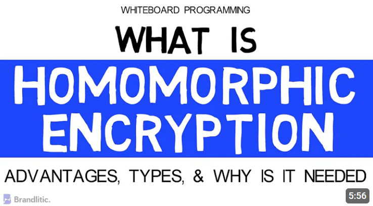

# Important Concepts
Before diving into the project, it is important to understand the concept of Fully Homomorphic Encryption and the layout of a Hardhat project.

## What is FHE?
Simply put, FHE is a form of cryptography that allows computations to be performed directly on encrypted data without needing to decrypt it first.

For a more in detailed explanation, see this 6min explanation:

## Think Encryption
Adding encryption to smart contracts requires some prior thought before one develops a natural sense of intuition. Many begin by writing contracts in Solidity before migrating to FHEVM or have systems running onchain already and need to upgrade. In order to ensure the lowest barrier experience, it is worthwhile to think about how Zama supports encryption and decryption.

### Encryption through the Relay SDK
Zama provides a Relay oracle which accepts user inputs and returns an encrypted handle, along with the proof of the encryption. Without delving too deep into the Relayer, it is enough for frontend and smart contract developers to understand the data types that are supported as well as the possible operations on these data types. In this way, developers can plan ahead and identify which data requires encryption and ensure that this data is represented as type that may be encrypted.

The data types which can be encrypted and returned as an external value are:
| Encrypted Type                                          | Description                                                                 |
|---------------------------------------------------------|-----------------------------------------------------------------------------|
| `ebool`                                                 | Encrypted Boolean. Enables logical operations on encrypted booleans.       |
| `euint4`                                                | Encrypted 4-bit unsigned integer. Useful for compact encrypted values.     |
| `euint8`, `euint16`, `euint32`, `euint64`               | Encrypted unsigned integers of respective bit widths.                      |
| `euint128`, `euint256`                                  | Larger encrypted unsigned integers for broader numeric operations.         |
| `eaddress`                                              | Encrypted Ethereum address.                                                |
| `externalEbool`                                         | External encrypted Boolean input (from relayer/off-chain).                 |
| `externalEuint4`, `externalEuint8`, ..., `externalEuint256` | External encrypted unsigned integers of various bit widths.                |
| `externalEaddress`                                      | External encrypted Ethereum address.                                       |

The operations which may be performed on these encrypted types **without** decryption are:

| **Operation Category**      | **Function / Operator**                             | **Inputs / Output**                      | **Description**                                                                 |
|-----------------------------|------------------------------------------------------|------------------------------------------|---------------------------------------------------------------------------------|
| Arithmetic                  | `+`, `−`, `*`, `/` or `TFHE.add`, `sub`, `mul`, `div` | Encrypted integers (euintX)              | Basic arithmetic on encrypted unsigned ints |
| Bitwise / Shift             | `&`, `|`, `^`, `~`, `TFHE.shr`, `TFHE.shl`           | euintX with euint8 or uint8 for shift    | Standard bitwise and modular shift operations|
| Comparison                  | `TFHE.eq`, `ne`, `gt`, `ge`, `lt`, `le`             | two euintX inputs → ebool output         | Comparison yielding encrypted boolean |
| Conditional select          | `TFHE.select(condition, a, b)`                       | `ebool`, two euintX → euintX             | Ternary-style selection based on encrypted |
| Min/Max           | `TFHE.min`, `TFHE.max`                               | two euintX → euintX                      | Minimum/maximum between two encrypted values |
| Binary NOT    | `TFHE.neg` (negate), `TFHE.not` (bitwise NOT)        | single euintX → euintX or change sign    | Unary operation support :contentReference|
| Random value generation     | `TFHE.randEuint8()`, `randEuint16()`, ...            | → euintX                                 | Fully on‑chain random generation per encrypted|
| Input parsing & validation  | `TFHE.asEuintX(input, proof)`                        | bytes + ZK proof → euintX                | Casts/verifies encrypted inputs via ZK proof |
| Decryption                  | `TFHE.decrypt(euintX)`                               | euintX → plaintext uintX or bool         | Triggers threshold decryption when condition |
| Re‑encryption / rekeying    | `TFHE.reencrypt(euintX, publicKey)`                  | euintX → ciphertext for user's key       | Enable secure client-side decryption using user-supplied public key |
| Encrypted branching         | `if/else` via encrypted condition + `select`         | ebool + branch logic                     | Enables conditional logic on encrypted state |

### Decryption through the Decryption Oracle
Zama offers several different options for decryption it is important to consider the following before coding:
- Where is the point of decryption?
  - Decrypt in the solidity smart contract itself?
  - Decrypt offchain, on the frontend?

In general, it is a good security practice to decrypt as close to the point of usage as possible. In our game, since the result is not required by the smart contract for token payout or any other onchain features, decryption is handled in the frontend. 

- Who has permission to decrypt?
  - Are only certain contracts or users able to request decryption?
  - Is the value publicly decryptable?

Regardless of the decryption context, the general decryption workflow follows these steps:
- Check the signature of the originator of the request
  - Always call the `checkSignature` function before decryption!
- Check the permission
  - This means that permission to decrypt must be explicitly given in code using `FHE.allowThis` and `FHE.allow(value, address)`.
- oracle performs decryption and returns results.

# Ready to start coding? Let's go!